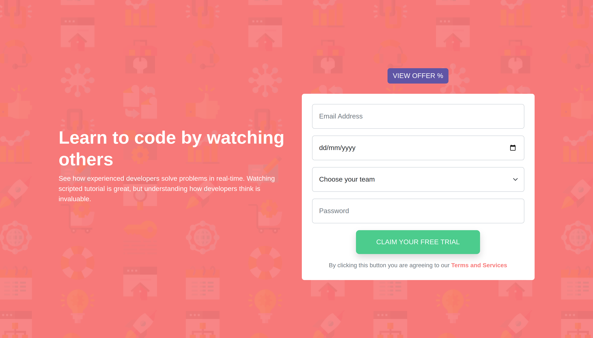

# Frontend Mentor - Intro component with sign-up form

This is a solution to the [Intro component with sign-up form challenge on Frontend Mentor](https://www.frontendmentor.io/challenges/intro-component-with-signup-form-5cf91bd49edda32581d28fd1). Frontend Mentor challenges help you improve your coding skills by building realistic projects. 

## Table of contents

- [Overview](#overview)
  - [The challenge](#the-challenge)
  - [Screenshot](#screenshot)
  - [Links](#links)
- [My process](#my-process)
  - [Built with](#built-with)
  - [What I learned](#what-i-learned)
  - [Continued development](#continued-development)
- [Author](#author)

## Overview

### The challenge

Users should be able to:

- View the optimal layout for the site depending on their device's screen size
- See hover states for all interactive elements on the page
- Receive an error message when the form is submitted if:
  - Any input field is empty
  - The email address is not formatted correctly

### Screenshot



### Links

- Solution URL: [Add solution URL here](https://your-solution-url.com)
- Live Site URL: [Add live site URL here](https://your-live-site-url.com)

## My process

### Built with

- Semantic HTML5 markup
- CSS custom properties
- Flexbox
- CSS Grid
- Bootstrap 5.2 (latest)
- Mobile-first workflow
- Validations

### What I learned

- Learnt to use validation for forms and displaying success alert upon submission.
- Complete project within given time frame.
- Mobile first responsive design.

To see how you can add code snippets, see below:

```css (bootstrap 5.2)
- Override the bootstrap defualt set of icons to the custom ones.

.was-validated .form-control:invalid {
    background-image: url('/content/images/icon-error.svg') !important;
    background-repeat: no-repeat !important;
    background-position: right calc(0.375em + 0.1875rem) center;
    background-size: calc(0.75em + 0.375rem) calc(0.75em + 0.375rem) !important;
}

- Changing icons position for date input.

input[type="date"] {
    background-position: right calc(2.375em + 0.1875rem) center !important;
}
```

### Continued development

- Planning before writing a code.
- Focusing one thing at a time following the flow of a structure.
- Skipping the part that you are not aware of and moving onto next part of code.
- Asking for mentors help.

## Author

- Website - [Add your name here](https://www.your-site.com)
- Frontend Mentor - [@rajatsardesai](https://www.frontendmentor.io/profile/rajatsardesai)