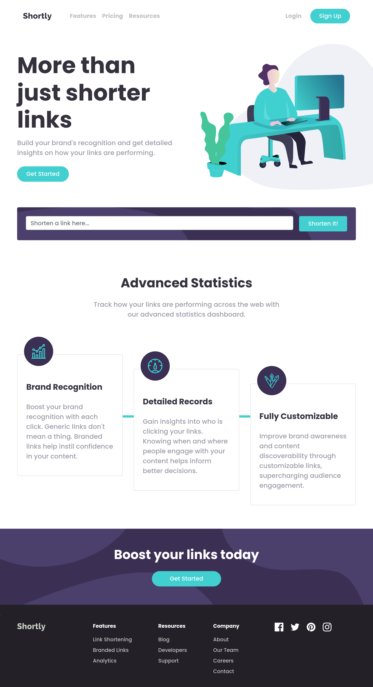

# Frontend Mentor - IP address tracker solution

This is a solution to the [URL shortening API landing page](https://www.frontendmentor.io/challenges/url-shortening-api-landing-page-2ce3ob-G). Frontend Mentor challenges help you improve your coding skills by building realistic projects. 

## Table of contents

- [Overview](#overview)
  - [The challenge](#the-challenge)
  - [Screenshot](#screenshot)
- [My process](#my-process)
  - [Built with](#built-with)
  - [What I learned](#what-i-learned)
  - [Continued development](#continued-development)
- [Author](#author)

## Overview

### The challenge

Users should be able to:

- View the optimal layout for the site depending on their device's screen size
- Shorten any valid URL
- See a list of their shortened links, even after refreshing the browser
- Copy the shortened link to their clipboard in a single click
- Receive an error message when the form is submitted if:
  - The input field is empty

### Screenshot



## My process

### Built with

- Semantic HTML5 markup
- CSS custom properties
- Flexbox
- CSS Grid
- Mobile-first workflow
- Validations
- https://shrtco.de/ (API for shortning links)

### What I learned

- Calling API to shorten the link.
- Copying link to clipboard.

To see how you can add code snippets, see below:

```js
- Line of code below used to copy the text to clipboard.

navigator.clipboard.writeText(url.innerText);

- Adding multiple classes using forEach loop.

const linkCls = ['card', 'p-4', 'border-0', 'mb-3', 'shadow', 'flex-md-row', 'align-items-md-center'];
linkCls.forEach(element => linkCard.classList.add(element));
```

### Continued development

- Planning before writing a code.
- Focusing one thing at a time following the flow of a structure.
- Skipping the part that you are not aware of and moving onto next part of code.
- Asking for mentors help.

## Author

- Frontend Mentor - [@rajatsardesai](https://www.frontendmentor.io/profile/rajatsardesai)